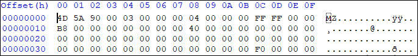
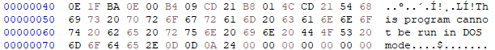
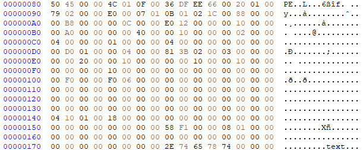

# PE File in nutshell

## I. Tổng quát

### 1. Định nghĩa

PE (Portable Executable) là một định dạng tập tin cho hệ điều hành Windows 32-bit và 64-bit, cũng như cho môi trường UEFI. Định dạng trên được sử dụng cho các tệp thực thi gốc _(.exe)_, thư viện liên kết động _(.dll)_, Kernel modules (.srv) và nhiều lọai file khác.

### 2. Cấu trúc

Nhìn chung, cấu trúc PE file có thể tóm tắt thành các phần sau (các thông tin trong đây chỉ mang tính chất tóm tắt):


- **_DOS Header_** : Bao gồm 64 bytes đầu tiên của file, có chức năng cho hệ thống biết đây là file PE hợp lệ.
- **_DOS Stub_** : Nếu môi trường hệ điều hành không hỗ trợ chạy file PE, thông báo ở vùng nãy sẽ hiện lên, thường là: **"This program cannot be run in DOS mode"**
- **_NT Header_** : Bao gồm 3 phần quan trọng: Signature, File Header và Optional Header. Thông tin chi tiết sẽ đề cập dến sau nhưng nói chung, thông tin của chúng rất quan trọng.
- **_Section Table_** : Chứa thông tin của các section
- **_Sections_** : Nội dung thật sự của file, bao gồm dữ liệu, tài nguyên và các thứ khác.

## II. Chi tiết cấu trúc

### 1. DOS Header:

Bao gồm 64 bytes đầu tiên, hay là 4 dòng đầu nếu xem bằng trình đọc hex với cấu trúc sau:

```c
typedef struct _IMAGE_DOS_HEADER {      // DOS .EXE header
    WORD   e_magic;          0x00           // Magic number
    WORD   e_cblp;           0x02           // Bytes on last page of file
    WORD   e_cp;             0x04           // Pages in file
    WORD   e_crlc;           0x06           // Relocations
    WORD   e_cparhdr;        0x08           // Size of header in paragraphs
    WORD   e_minalloc;       0x0A           // Minimum extra paragraphs needed
    WORD   e_maxalloc;       0x0C           // Maximum extra paragraphs needed
    WORD   e_ss;             0x0E           // Initial (relative) SS value
    WORD   e_sp;             0x10           // Initial SP value
    WORD   e_csum;           0x12           // Checksum
    WORD   e_ip;             0x14           // Initial IP value
    WORD   e_cs;             0x16           // Initial (relative) CS value
    WORD   e_lfarlc;         0x18           // File address of relocation table
    WORD   e_ovno;           0x1A           // Overlay number
    WORD   e_res[4];         0x1C           // Reserved words
    WORD   e_oemid;          0x24           // OEM identifier (for e_oeminfo)
    WORD   e_oeminfo;        0x26           // OEM information; e_oemid specific
    WORD   e_res2[10];       0x28           // Reserved words
    <strong>LONG   e_lfanew; 0x3C                   // Offset to the NT header
  } IMAGE_DOS_HEADER, *PIMAGE_DOS_HEADER;
```



- **e_magic**: Signature của PE file, hay còn được gọi là **magic number**, dùng để xác định đây là file PE. Offset của miền này là 0x5A4D, hay là **MZ** trong bảng chữ cái ASCII.

* **e_cblp**: Số byte trong page cuối của file không được sử dụng. Thường được đặt thành 0.
* **e_cp**: Số trang 512 byte trong file. Trường này cũng thường được đặt thành 0.
* **e_crlc**: Số entry tái vị trí trong file. Thường được đặt thành 0.
* **e_cparhdr**: Kích thước của header tính theo đoạn 16 byte. Đối với tệp PE tiêu chuẩn, trường này thường được đặt thành 4.
* **e_minalloc**: Số đoạn tối thiểu được phân bổ cho chương trình. Thường được đặt thành 0x10.
* **e_maxalloc**: Số đoạn tối đa được phân bổ cho chương trình. Thường được đặt thành 0xFFFF.
* **e_ss**: Giá trị stack segment ban đầu. Trường này thường được đặt thành 0.
* **e_sp**: Giá trị stack pointer ban đầu. Thường được đặt thành 0xB8.
* **e_csum**: Checksum. Thường được đặt thành 0.
* **e_ip**: Giá trị con trỏ lệnh _(Instruction Pointer - IP)_ ban đầu. Thường được đặt thành 0.
* **e_cs**: Giá trị code segment ban đầu. Giá trị này thường được đặt thành 0.
* **e_lfarlc**: Địa chỉ file của bảng tái vị trí. Giá trị này thường được đặt thành 0x40.
* **e_ovno**: Số overlay. Giá trị này thường được đặt thành 0.
* **e_res**: Một array được dành riêng để sử dụng trong tương lai.
* **e_oemid**: Mã định danh OEM. Giá trị này thường được đặt thành 0.
* **e_oeminfo**: Thông tin OEM. Giá trị này thường được đặt thành 0.
* **e_res2**: Một mảng 10 byte được dành riêng để sử dụng trong tương lai.

- **e_lfanew**: Vị trí offset của NT header. Luôn luôn nằm ở offset 0x3C. Sự tồn tại của e_lfanew giúp cho hệ thống tìm được NT Header.

Các thông tin còn lại có trong DOS Header chỉ mang tính chất tham khảo, cho nên sẽ không đề cập sâu thêm ngoài chú thích có trong đoạn code.

### 2. DOS Stub

Mục đích chính của mục này chỉ là để thông báo với người dùng rằng môi trường hệ điều hành có phù hợp để chạy tệp tin hay là không. Ví dụ, nếu môi trường không hỗ trợ chạy Win32 mà khởi động ứng dụng được làm trên nền tảng Win32 thì tin nhắn **"This is program cannot be run in DOS mode"** sẽ hiện lên.



Thông báo trên là mặc định, tức là các compiler khi compile chương trình sẽ luôn mặc định thêm thông báo này vào. Nói cách khác, thông báo này có thể tùy ý điều chỉnh trên compiler để khi compile chương trình thì chương trình sẽ hiện thị dòng thông báo mà bản thân mong muốn. Trên lý thuyết là vậy.

### 3. NT Header

Được định nghĩa cấu trúc bởi `winnt.h` dưới tên gọi `IMAGE_NT_HEADERS`, NT Header bao gồm 3 phần:



```c
typedef struct _IMAGE_NT_HEADERS64 {
    DWORD Signature;                            0x00
    IMAGE_FILE_HEADER FileHeader;
    IMAGE_OPTIONAL_HEADER64 OptionalHeader;
} IMAGE_NT_HEADERS64, *PIMAGE_NT_HEADERS64;
```

#### 3.1 Signature:

Bao gồm 4 bytes đầu tiên, luôn luôn có giá trị mặc định là `0x50450000`, hay `PE\0\0` trong bảng chữ cái ASCII.

#### 3.2 FileHeader:

20 bytes tiếp theo của PE file chứa những thông tin cơ bản của file, với cấu trúc cũng được định nghĩa bởi `winnt.h`:

```c
typedef struct _IMAGE_FILE_HEADER {
    WORD    Machine;                         0x04
    WORD    NumberOfSections;                0x06
    DWORD   TimeDateStamp;                   0x08
    DWORD   PointerToSymbolTable;            0x0C
    DWORD   NumberOfSymbols;                 0x10
    WORD    SizeOfOptionalHeader;            0x14
    WORD    Characteristics;                 0x16
} IMAGE_FILE_HEADER, *PIMAGE_FILE_HEADER;
```

- **Machine**: Xác định kiểu kiến trúc CPU mà PE file nhắm tới, thường là `0x8864` cho AMD64 hay `0x14c` cho i386. Giá trị này chỉ định kiểu kiến trúc CPU mà phần mềm chạy được.
- **NumberOfSections**: Số lượng section nằm trong file này.
- **TimeDateStamp**: Thời gian file được tạo, dưới định dạng UNIX
- **SizeOfOptionalHeader**: Kích cỡ của Optional Header
- **Characteristics**: Giá trị thể hiện "thuộc tính" của file, chi tiết các giá trị thể hiện đều nằm trong [PE Format của Microsoft](https://learn.microsoft.com/en-us/windows/win32/debug/pe-format#characteristics)

#### 3.2 OptionalHeader:

Đây là phần thông tin quan trọng nhất nằm trong NT Header vì các công cụ chạy file PE sẽ tìm kiếm các thông tin cần thiết trong trường dữ liệu này để chạy file PE một cách bình thường. Lý do cho cái tên "Optional" là vì một số loại file PE không chứa trường dữ liệu này.
Dữ liệu của OptionalHeader nằm trong struct **_IMAGE_OPTIONAL_HEADER_**:

```c
typedef struct _IMAGE_OPTIONAL_HEADER {
    \\ Standard fields
  WORD                 Magic;                            0x18
  BYTE                 MajorLinkerVersion;               0x1A
  BYTE                 MinorLinkerVersion;               0x1B
  DWORD                SizeOfCode;                       0x1C
  DWORD                SizeOfInitializedData;            0x20
  DWORD                SizeOfUninitializedData;          0x24
  DWORD                AddressOfEntryPoint;              0x28
  DWORD                BaseOfCode;                       0x2C
  DWORD                BaseOfData;                       0x30
    \\ NT Additional fields
  DWORD                ImageBase;                        0x34
  DWORD                SectionAlignment;                 0x38
  DWORD                FileAlignment;                    0x3C
  WORD                 MajorOperatingSystemVersion;      0x40
  WORD                 MinorOperatingSystemVersion;      0x42
  WORD                 MajorImageVersion;                0x44
  WORD                 MinorImageVersion;                0x46
  WORD                 MajorSubsystemVersion;            0x48
  WORD                 MinorSubsystemVersion;            0x4A
  DWORD                Win32VersionValue;                0x4C
  DWORD                SizeOfImage;                      0x50
  DWORD                SizeOfHeaders;                    0x54
  DWORD                CheckSum;                         0x58
  WORD                 Subsystem;                        0x5C
  WORD                 DllCharacteristics;               0x5E
  DWORD                SizeOfStackReserve;               0x60
  DWORD                SizeOfStackCommit;                0x64
  DWORD                SizeOfHeapReserve;                0x68
  DWORD                SizeOfHeapCommit;                 0x6C
  DWORD                LoaderFlags;                      0x70
  DWORD                NumberOfRvaAndSizes;              0x74
  IMAGE_DATA_DIRECTORY DataDirectory[IMAGE_NUMBEROF_DIRECTORY_ENTRIES];
} IMAGE_OPTIONAL_HEADER32, *PIMAGE_OPTIONAL_HEADER32;
```

- **Magic**: Giá trị ở đây thể hiện file này ở dưới định dạng 32-bit, 64-bit hay ROM.
  | Magic number | PE format |
  | -------- | -------- |
  | 0x10b | PE32 |
  | 0x20b | PE32+ |
  | 0x107 | ROM |
- **MajorLinkerVersion/MinorLinkerVersion**: Số phiên bản chính và phụ của Linker?
- **SizeOfCode**: Kích cỡ của section code _(.text)_. Nếu có nhiều hơn một section, thì sẽ là tổng của tất cả section đó.
- **SizeOfInitializedData**: Kích thước của section dữ liệu đã khởi tạo _(.data)_. Nếu có nhiều hơn một section, thì sẽ là tổng của tất cả section đó.
- **SizeOfUninitializedData**: Kích thước của section dữ liệu chưakhởi tạo _(.bss)_. Nếu có nhiều hơn một section, thì sẽ là tổng của tất cả section đó.
- **AddressOfEntryPoint**: Đây là địa chỉ nơi trình tải Windows sẽ bắt đầu thực thi. Địa chỉ này chứa RVA (Relative Virtual Address) của entry point và thường tìm thấy ở section _.text_. Nếu không có entry point, thì giá trị này được đặt = 0.
- **BaseOfCode**: Giữ RVA khởi đầu của section code.
- **BaseOfData**: Giữ RVA khởi đầu của section data.
- **ImageBase**: Lưu trữ địa chỉ byte đầu tiên của file PE vào bộ nhớ, địa chỉ này luôn là bội của 64K. Do các trình bảo vệ bộ nhớ như của ASLR (Address Space Layout Randomization), và do một số lý do khác nên địa chỉ được nêu ở trong đây thường sẽ không được sử dụng đến. Địa chỉ của file do đó sẽ được chọn trong không gian bộ nhớ chưa được sử dụng để nạp file vào. Do đó trong file sẽ xuất hiện thêm một section là section "Tái vị trí" _(.reloc)_ với mục đích di dời địa chỉ cũ của file ra một địa chỉ mới mà không xảy ra xung đột trong file.
- **SectionAlignment**: Giá trị dể bộ nhớ đặt khoảng trống để đặt section vào, phần thừa sẽ được padding sao cho đủ giá trị.
- **FileAlignment**: Như trên nhưng dành cho dữ liệu thô nằm trên disk.
- **MajorOperatingSystemVersion/MinorOperatingSystemVersion**: Thông số phiên bản chính/phụ của hệ điều hành mà PE file yếu cầu
- **MajorImageVersion/MinorImageVersion**: Phiên bản chính/phụ của file.
- **MajorSubsystemVersion/MinorSubsystemVersion**: Phiên bản chính/phụ của hệ thống phụ (subsystem).
- **Win32VersionValue**: Mặc định luôn là 0. Chi tiết nằm trong tài liệu của Microsoft
- **SizeOfImage**: Bao gồm tất cả header, section và phần padding. Chỉ số này luôn là bội của SectionAlignment.
- **SizeOfHeaders**: Tổng kích thước MS-DOS stub + PE header + section headers, được làm tròn lên sao cho là bội của chỉ số FileAlignment.
- **Checksum**: Được tính toán bởi thuật toán nằm trong IMAGHELP.DLL nhằm check tính hợp lệ tại thời điểm được nạp vào PE loader.
- **Subsystem**: Yêu cầu hệ thống cần để chạy file. Dưới đây là một số giá trị tham khảo được trích từ Microsoft, thông tin chi tiết nằm ở cuối bài.

    | Constant                       | Value | Meaning                                 |
    | ------------------------------ | ----- | --------------------------------------- |
    | IMAGE_SUBSYSTEM_UNKNOWN        | 0     | Unknown subsystem                       |
    | IMAGE_SUBSYSTEM_NATIVE         | 1     | Image doesn’t require a subsystem       |
    | IMAGE_SUBSYSTEM_WINDOWS_GUI    | 2     | Runs in the Windows GUI subsystem       |
    | IMAGE_SUBSYSTEM_WINDOWS_CUI    | 3     | Runs in the Windows character subsystem |
    | IMAGE_SUBSYSTEM_OS2_CUI        | 5     | Runs in the OS/2 character subsystem    |
    | IMAGE_SUBSYSTEM_POSIX_CUI      | 7     | Runs in the Posix character subsystem   |
    | IMAGE_SUBSYSTEM_NATIVE_WINDOWS | 8     | Windows CE GUI subsystem                |

- **DLLCharacteristíc**: Một vài tính chất của file. Dưới đây là một số giá trị tham khảo:
  | Constant | Value | Meaning |
  | -------------------------------------------| ----- |-----------------------------------------|
  | | 0x0001 | Reserved, must be zero. |
  | | 0x0002 | Reserved, must be zero. |
  | IMAGE_DLLCHARACTERISTICS<br>\_HIGH_ENTROPY_VA | 0x0020 | Image can handle a high entropy 64-bit virtual address space. |
  | IMAGE_DLLCHARACTERISTICS<br>\_DYNAMIC_BASE | 0x0040 | DLL can be relocated at load time. |
  | IMAGE_DLLCHARACTERISTICS<br>\_NX_COMPAT | 0x0100 | Image is NX compatible. |
  | IMAGE_DLLCHARACTERISTICS<br>\_NO_ISOLATION | 0x0200 | Isolation aware, but do not isolate the image.|
  | IMAGE_DLLCHARACTERISTICS<br>\_NO_BIND | 0x0800 | Do not bind the image.|
- **SizeOfStackReserve**: Kích thước của stack cần được phân bổ trước. Chỉ SizeOfStackCommit được phân bố; phần còn lại sẽ được cung cấp từng page cho đến khi đạt đến kích thước đã được phân bổ.
- **SizeOfHeapCommit**: Kích cỡ của không gian heap cục bộ cần phân bố.
- **LoaderFlags**: Luôn bằng 0.
- **NumberOfRvaAndSizes**: Số lượng entry của dải Data Directory.

#### 3.3 DataDirectory:

Đây là thành phần cuối cùng của Optional Header. Lý do cho việc được đặt ngang hàng với các phân mục trên là vì bản thân nó có cấu trúc riêng, và những thông tin trong đây cũng rất quan trọng để phân tích:

```c
IMAGE_DATA_DIRECTORY DataDirectory[IMAGE_NUMBEROF_DIRECTORY_ENTRIES]
```

Đây là khai báo của Array DataDirectory, với kích thước được đặt là 16:

```c
#define IMAGE_NUMBEROF_DIRECTORY_ENTRIES    16
```

struct IMAGE_DATA_DIRECTORY bao gồm 2 thành phần:

- VirtualAddress: là một RVA chỉ tới offset bắt đầu của data directory.
- Size: Kích cỡ của data directory dưới dạng bytes.

```c
typedef struct _IMAGE_DATA_DIRECTORY {
  DWORD VirtualAddress;
  DWORD Size;
} IMAGE_DATA_DIRECTORY, *PIMAGE_DATA_DIRECTORY;
```

Mục đích tồn tại của Data Directory nhằm giúp cho các trình nạp file PE biết được những thông tin quan trọng khác ngoài dòng dữ liệu chính.

Dưới đây là danh sách thông tin có trong DataDirectory:

```c
#define IMAGE_DIRECTORY_ENTRY_EXPORT          0   // Export Directory
#define IMAGE_DIRECTORY_ENTRY_IMPORT          1   // Import Directory
#define IMAGE_DIRECTORY_ENTRY_RESOURCE        2   // Resource Directory
#define IMAGE_DIRECTORY_ENTRY_EXCEPTION       3   // Exception Directory
#define IMAGE_DIRECTORY_ENTRY_SECURITY        4   // Security Directory
#define IMAGE_DIRECTORY_ENTRY_BASERELOC       5   // Base Relocation Table
#define IMAGE_DIRECTORY_ENTRY_DEBUG           6   // Debug Directory
#define IMAGE_DIRECTORY_ENTRY_ARCHITECTURE    7   // Architecture Specific Data
#define IMAGE_DIRECTORY_ENTRY_GLOBALPTR       8   // RVA of GP
#define IMAGE_DIRECTORY_ENTRY_TLS             9   // TLS Directory
#define IMAGE_DIRECTORY_ENTRY_LOAD_CONFIG    10   // Load Configuration Directory
#define IMAGE_DIRECTORY_ENTRY_BOUND_IMPORT   11   // Bound Import Directory in headers
#define IMAGE_DIRECTORY_ENTRY_IAT            12   // Import Address Table
#define IMAGE_DIRECTORY_ENTRY_DELAY_IMPORT   13   // Delay Load Import Descriptors
#define IMAGE_DIRECTORY_ENTRY_COM_DESCRIPTOR 14   // COM Runtime descriptor
```

Trong số các dữ liệu trên, 2 phần cần để ý nhất là **Export Directory** _(IMAGE_DIRECTORY_ENTRY_EXPORT)_ và **Import Address Table** _(IMAGE_DIRECTORY_ENTRY_IAT)_:

- **Export Directory**: Chứa những cấu trúc dữ liệu bao gồm địa chỉ của các hàm và biến được xuất ra bên ngoài. Những địa chỉ này sau đó được sử dụng bởi các file thức thi khác dùng để truy cập vào các hàm, biến hay dữ liệu đã được xuất ra.
- **Import Address Table**: Bao gồm thông tin về các hàm đươc lấy vào từ các file thực thi khác. Các địa chỉ trong bảng này sau đó được sử dụng để truy cập vào hàm và dữ liệu đến từ các file thực thi khác.

### 4. Section Header Table:

Nằm ngay sau Optional Header, Section Header Table bao gồm các thông tin cơ bản của các section, như là kích cỡ, vị trí hay địa chỉ truy cập.

Cấu trúc của IMAGE_SECTION_HEADER biểu diễn như sau:

```c
typedef struct _IMAGE_SECTION_HEADER {
    BYTE    Name;
    union {
            DWORD   PhysicalAddress;
            DWORD   VirtualSize;
    } Misc;
    DWORD   VirtualAddress;
    DWORD   SizeOfRawData;
    DWORD   PointerToRawData;
    DWORD   PointerToRelocations;
    DWORD   PointerToLinenumbers;
    WORD    NumberOfRelocations;
    WORD    NumberOfLinenumbers;
    DWORD   Characteristics;
} IMAGE_SECTION_HEADER, *PIMAGE_SECTION_HEADER;
```

- **Name**: Một dãy 8-byte chứa tên của các section _(Ví dụ: ".text", ".data", ."rsrc")_. Ngoài những section mặc định, các phần mềm độc hại _(malware)_ có thể xuất hiện những section "lạ" nhằm che giấu hành vi thật sự.
- VirtualSize: Kích cỡ của section khi được nạp vào memory
- VirtualAddress: Đối với các file thực thi, đây là giá trị địa chỉ byte đầu tiên của section so với ImageBase khi section được nạp vào bộ nhớ, còn đối với các file object, nó là giá trị byte đầu tiên của section trước khi việc tái vị trí (relocation) được áp dụng.
- **SizeOfRawData**: Kích cỡ "thật" của section, tức là kích cỡ dữ liệu thô _(raw data)_ nằm trên ổ đĩa, và nó phải là bội của FileAlignment.
- **PointerToRawData**: Offset trỏ tới page đầu tiên của section nằm trong file, đối với file thực thi thì nó phải là bội của FileAlignment.
- **PointerToRelocations**: Con trỏ tệp trỏ đến đầu mục entry của section.
- **NumberOfRelocations**: Tổng số entry tái vị trí. Đối với các file thực thi, giá trị được đặt về 0.
- **NumberOfLinenumbers**: Số lượng mục nhập số dòng (line-number entries) cho phần đó. Giá trị này không có được sử dụng và được đặt về 0.
- **Characterítíc**: Giá trị biểu lộ một số tính chất của section. Dưới đây là một số tính chất, chi tiết nằm ở cuối bài:
  | Flag | Value | Description |
  | ------------------------------ | ----- |-----------------------------------------|
  | IMAGE_SCN_TYPE_NO_PAD | 0x00000008 | The section should not be padded to the next boundary. This flag is obsolete and is replaced by IMAGE_SCN_ALIGN_1BYTES. This is valid only for object files. |
  | IMAGE_SCN_CNT_CODE | 0x00000020 | The section contains executable code. |
  | IMAGE_SCN_CNT_INITIALIZED_DATA | 0x00000040| The section contains initialized data.|
  | IMAGE_SCN_LNK_NRELOC_OVFL |0x01000000 |The section contains extended relocations.|
  | IMAGE_SCN_MEM_DISCARDABLE |0x02000000|The section can be discarded as needed. |
  | IMAGE_SCN_MEM_READ |0x40000000|The section can be read. |
  | IMAGE_SCN_MEM_WRITE |0x80000000 | The section can be written to. |

### 5. PE Sections:

Nội dung trong phần này bao gồm toàn bộ đoạn mã thực sự của file và các dữ liệu kèm theo. Mỗi một section trong đây điều có nhiệm vụ cụ thể và riêng biệt

Các section "thường" được phân biệt bằng tên gọi, dưới đây là một số section hay xuất hiện ở đa phần PE file:

- **.text/.code**: Chứa đoạn code thực thi của PE file.
- **.data**: Chứa dữ liệu đã khởi tạo. Dữ liệu này có thể truy cập bởi bất cứ đâu trong chương trình.
- **.rdata**: Dữ liệu chỉ đọc đã khởi tạo, bao gồm các hằng số và các dữ liệu chỉ đọc. Có thể truy cập bởi bất cứ đâu trong chương trình.
- **.idata**: Biểu diễn và lưu trữ thông tin import trong chương trình. Nếu section này không tồn tại, thông tin có thể nằm trong **.rdata**.
- **.reloc**: Chứa thông tin tái vị trí file được dùng để nạp file vào bộ nhớ vào vị trí khác với vị trí được ghi trong ImageBase mà không xảy ra lỗi.
- **.rsrc:**: Chứa các tài nguyên được sử dụng bởi chương trình, bao gồm: ảnh, icon, mã nhúng,....

## III. Tham khảo

1. https://en.wikipedia.org/wiki/Portable_Executable
2. https://offwhitesecurity.dev/malware-development/portable-executable-pe
3. https://learn.microsoft.com/en-us/windows/win32/debug/pe-format
4. https://0xrick.github.io/win-internals/pe2
5. https://tech-zealots.com/malware-analysis/pe-portable-executable-structure-malware-analysis-part-2
6. https://www.sunshine2k.de/reversing/tuts/tut_pe.htm
